# Personalized Networking Assistant

## Hero Banner

AI-powered networking support platform for conferences, workshops,
seminars, hackathons, and professional events.

## Badges

-   Python 3.11
-   FastAPI
-   Streamlit
-   HuggingFace Transformers
-   SmartBridge Capstone

## Table of Contents

1.  Overview
2.  Problem Statement
3.  Objectives
4.  Features
5.  Tech Stack
6.  Architecture
7.  Installation
8.  Usage
9.  Screenshots
10. Future Work

## Project Overview

Personalized Networking Assistant helps users generate intelligent
conversation starters based on event themes and personal interests.

## Problem Statement

Networking events are difficult for attendees who struggle to identify
meaningful conversation topics quickly.

## Objectives

-   Extract event themes
-   Generate conversation starters
-   Provide factual context
-   Maintain interaction history

## Features

-   Event Theme Extraction
-   GPT2 Conversation Generation
-   Fact Checking
-   Swagger APIs
-   Streamlit Frontend
-   History Tracking
-   Feedback Collection

## Technology Stack

  Component    Technology
  ------------ ------------
  Backend      FastAPI
  Frontend     Streamlit
  NLP          DistilBERT
  Generation   GPT2
  Framework    PyTorch

## System Architecture

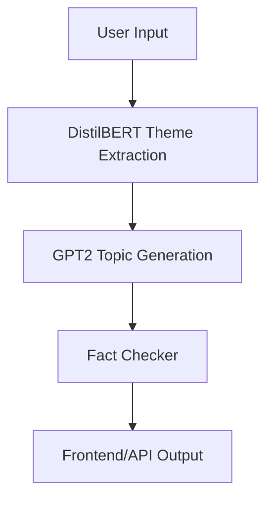

## Workflow

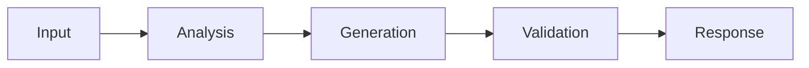

## Project Structure

``` text
app/
frontend/
tests/
data/
logs/
screenshots/
demo_video/
README.md
requirements.txt
```

## Installation

``` bash
git clone https://github.com/rg-reddy/PersonalizedNetworkingAssistant.git
cd PersonalizedNetworkingAssistant
python -m venv .venv
.venv\Scripts\activate
pip install -r requirements.txt
```

## Run Backend

``` bash
uvicorn app.main:app --reload
```

## Run Frontend

``` bash
streamlit run frontend\streamlit_app.py
```

## API Docs

http://127.0.0.1:8000/docs

## Testing

``` bash
pytest -v
```

## Screenshots

### Environment Setup
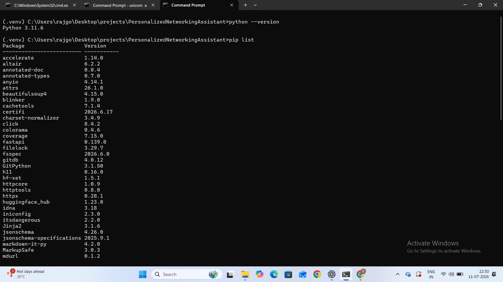

### Project Structure
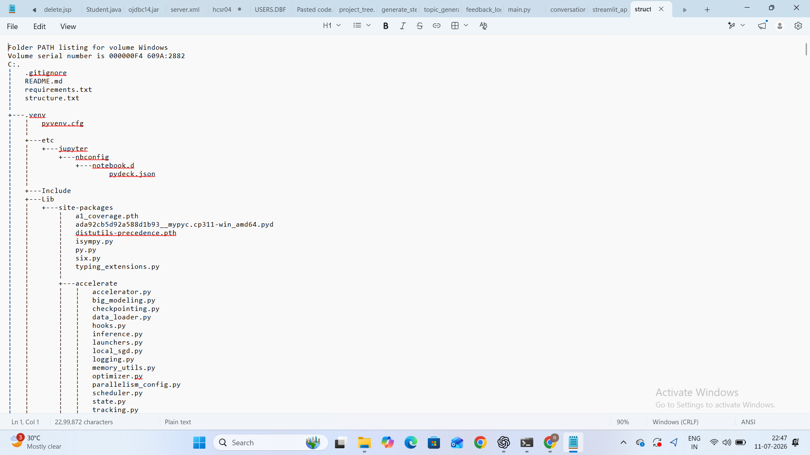

### DistilBERT Output
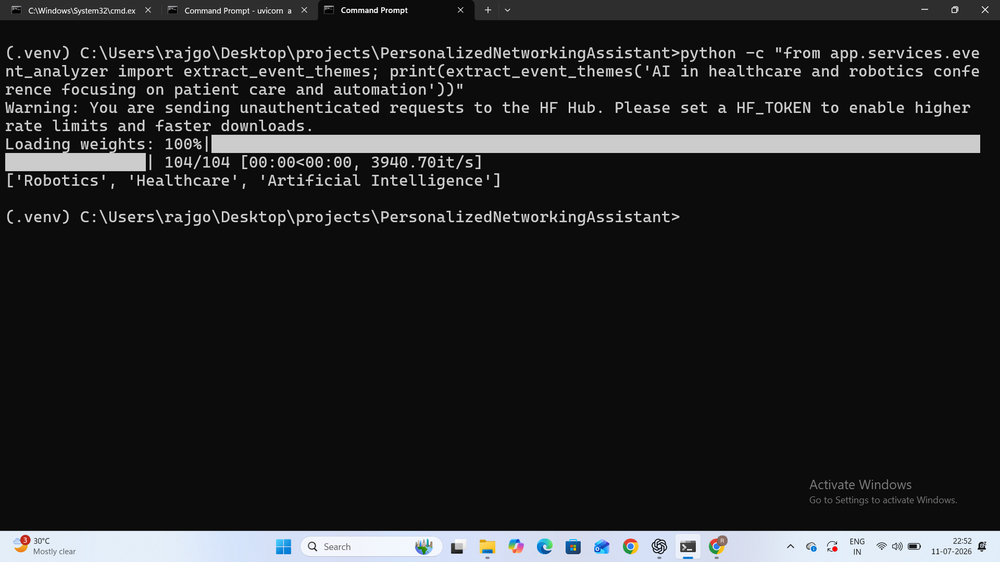

### GPT-2 Generation
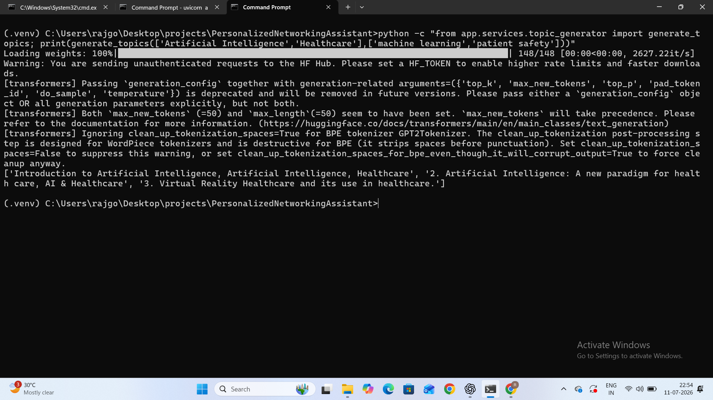

### Fact Checker
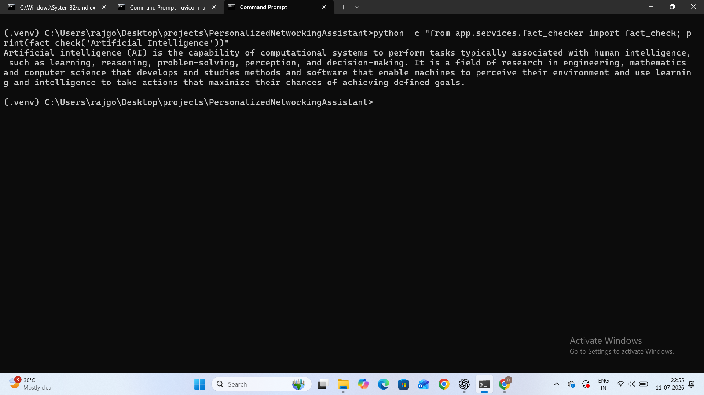

### Swagger UI
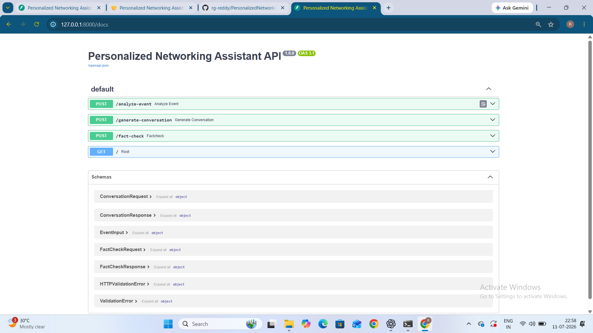

### Backend Running
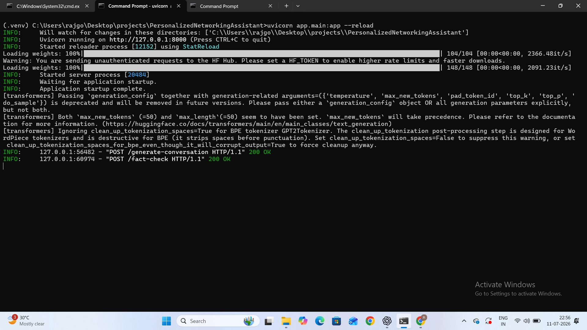

### Frontend Home
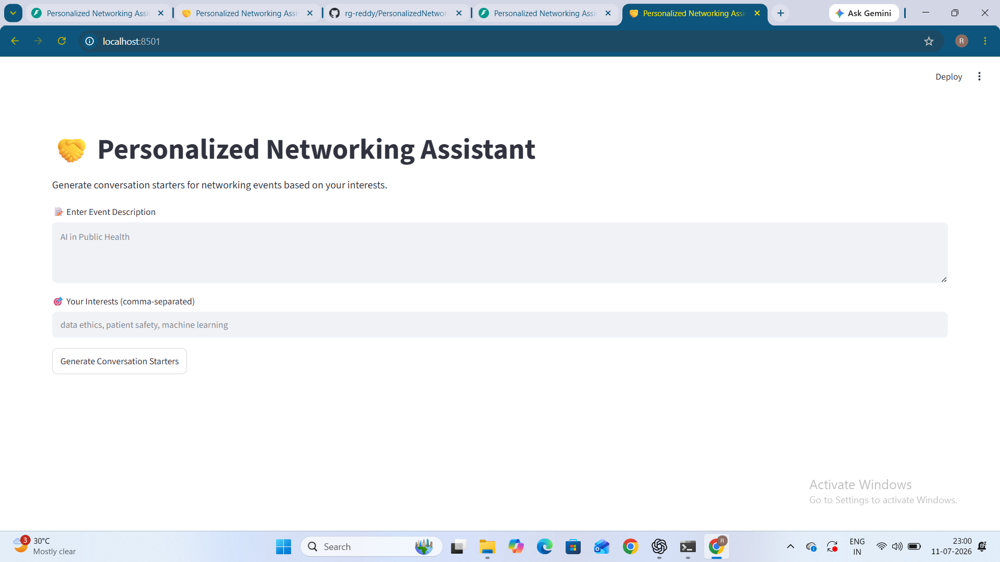

### Final Output
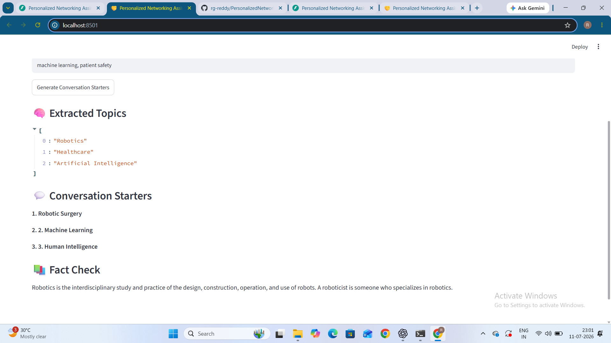

### GitHub Repository
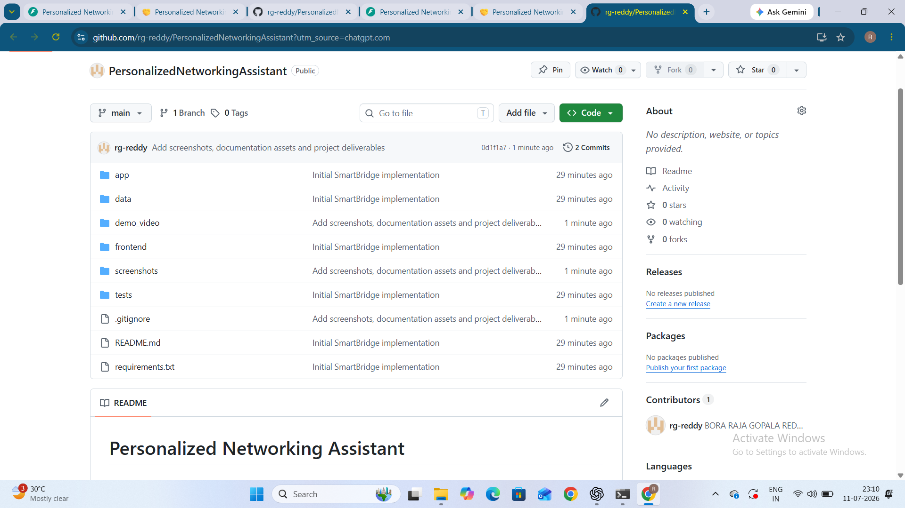

## Challenges

-   GPT2 output quality
-   Model loading time
-   Dependency management

## Solutions

-   Prompt engineering
-   Cached models
-   Structured project layout

## Performance Considerations

-   Lazy model loading
-   Lightweight frontend

## Future Enhancements

-   Better LLM integration
-   Cloud deployment
-   User profiles

## Learning Outcomes

-   FastAPI APIs
-   Transformer pipelines
-   AI deployment workflows

## Contribution Guide

Fork repository, create branch, commit changes, and submit PR.

## SmartBridge Compliance

Project follows SmartBridge capstone structure and deliverables.

## Deliverables

-   Source code
-   README
-   Screenshots
-   Demo video

## Documentation

Technical documentation included in repository.

## License

Educational and academic usage.

## Author

Raja Gopala Reddy Bora\
MVGR College of Engineering\
Roll No: 23331A4208

## Contact

GitHub: https://github.com/rg-reddy\
LinkedIn: https://www.linkedin.com/in/raja-gopala-reddy-bora/
Repository: https://github.com/rg-reddy/PersonalizedNetworkingAssistant

## Professional Conclusion

This project demonstrates practical application of NLP, transformer
models, APIs, and AI engineering practices suitable for SmartBridge
submissions, placements, and portfolios.
